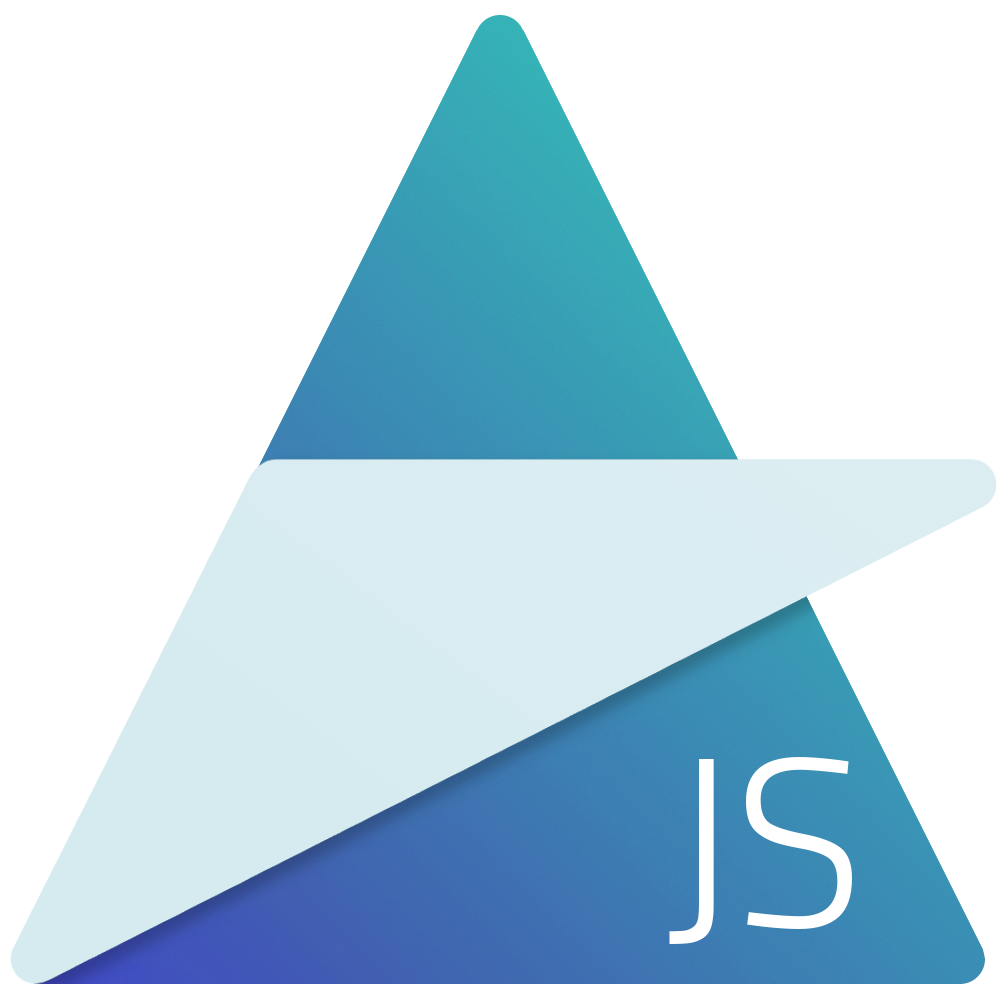

# AugJS

### A Simple Component-based Javascript Framework

---

AugJS is a simple, streamlined UI Templating framework that acts as a light-weight wrapper around the upcoming Web Component and Shadow DOM standards.

It's features include:

- Scoped CSS
- Straightforward Templating
- Modularized, Pluggable Code

View it in action [here](https://tehjawn.github.io/AugJS/src/)

---

### Changelist

#### 3/24/2017

- v0.4.0 --> v0.6.1 (to match with SRC6 version and some added tweaks)

- Tutorials, Documentation and Examples Pages for v0.6.1 Finished

#### 3/24/2017

- Augject view replacing works!

- Tutorials, Documentation and Examples Pages for v0.4.0 Started

#### 3/22/2017

- Moved SRC4 and SRC5 to /old

- SRC6 (/src) rewritten from scratch based on legacy Shadow DOM (createShadowRoot and content instead of attachShadow and slot) with additional features such as one-way data-binding through a primitive version of handlebars

---

Made by John Nguyen in the year of 2017
