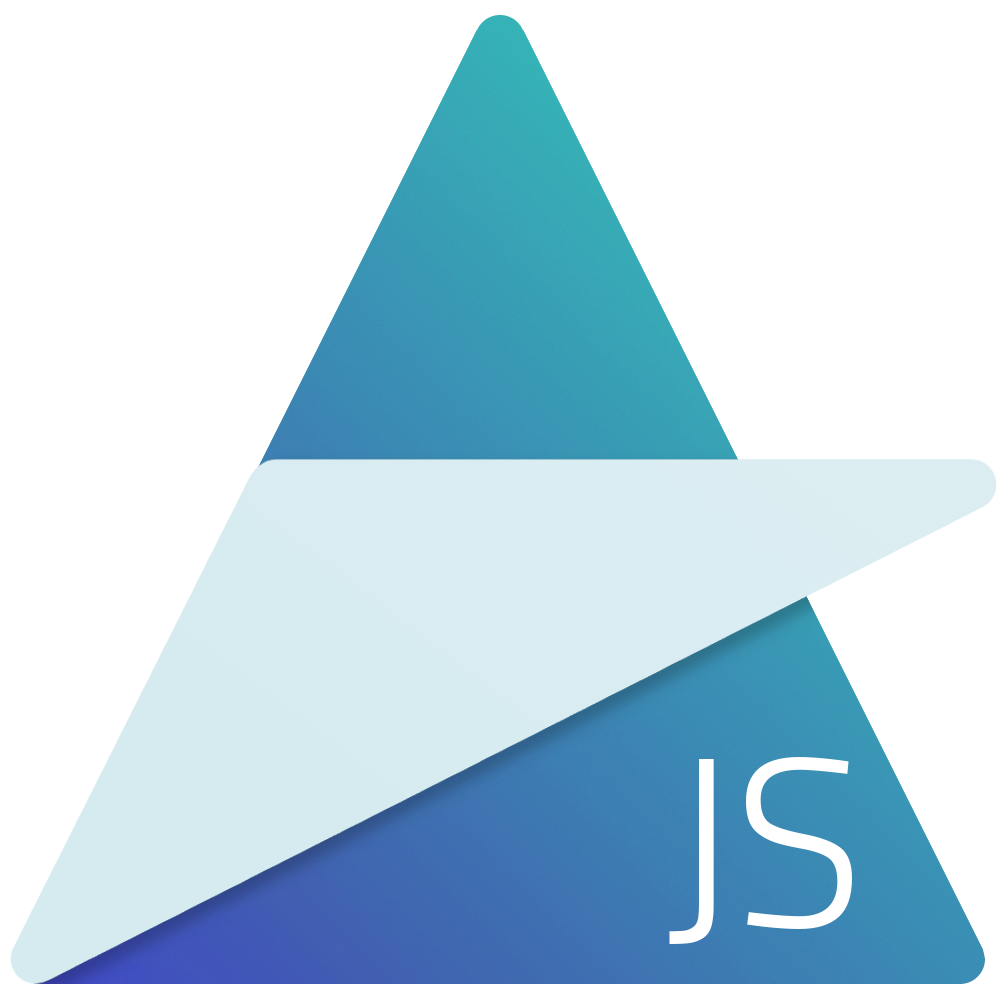

# AugJS

### A Simple Component-based Javascript Framework

---

AugJS is a simple, streamlined UI Templating framework that acts as a light-weight wrapper around the upcoming Web Component and Shadow DOM standards.

It's features include:

- Scoped CSS
- Straightforward Templating
- Modularized, Pluggable Code

View SRC3 [here](https://tehjawn.github.io/AugJS/old/src3/)
View SRC4 [here](https://tehjawn.github.io/AugJS/old/src4/)

---

Latest changes:

- Added SRC4, an ES6 version which has updated designs
- Began new SRC, which will utilize slot-based template mechanics

---

Made by John Nguyen in the year of 2017
